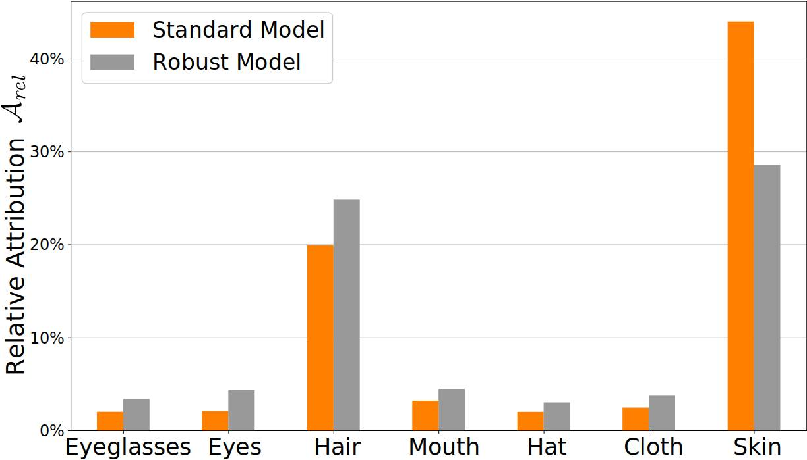

# Image Classifiers Leak Sensitive Attributes About Their Classes

  <center>
  
  </center>

> **Abstract:**
> *Neural network-based image classifiers are powerful tools for computer vision tasks, but they inadvertently reveal sensitive attribute information about their classes, raising concerns about their privacy. To investigate this privacy leakage, we introduce the first **C**lass **A**ttribute **I**nference **A**ttack (**CAIA**), which leverages recent advances in text-to-image synthesis to infer sensitive attributes of individual classes in a black-box setting, while remaining competitive with related white-box attacks. Our extensive experiments in the face recognition domain show that CAIA can accurately infer undisclosed sensitive attributes, such as an individual's hair color, gender, and racial appearance, which are not part of the training labels. Interestingly, we demonstrate that adversarial robust models are even more vulnerable to such privacy leakage than standard models, indicating that a trade-off between robustness and privacy exists.*  

# Setup and Preparation

## Setup Docker Container
The easiest way to perform our experiments is to run the code in a Docker container. To build the Docker image, run the following script:

```bash
docker build -t caia  .
```

Our Dockerfile also allows storing a Weights & Biases API key directly in the image. For this, provide the API key as an argument when building the image:
```bash
docker build -t caia --build-arg wandb_key=xxxxxxxxxx .
```

To create and start a Docker container, run the following command from the project's root:

```bash
docker run --rm --shm-size 16G --name caia_0 --gpus '"device=0"' -v $(pwd):/workspace -it caia bash
```

To add additional GPUs, modify the option ```'"device=0,1,2"'``` accordingly. Detach from the container using ```Ctrl+P``` followed by ```Ctrl+Q```.


## Setup Weights & Biases
We rely on Weights & Biases for experiment tracking and result storage. A free account is needed at [wandb.ai](https://wandb.ai/site) to track the experiments. Note that we do not have any commercial relationship with Weights & Biases. 

To connect an account to Weights & Biases, run the following command and add an API key (if not provided earlier in the ```docker build``` command):
```bash
wandb init
```
You can find the key at [wandb.ai/settings](https://wandb.ai/settings). After the key was added, stop the script with ```Ctrl+C```. 

## Prepare Training Datasets
We support [FaceScrub](http://vintage.winklerbros.net/facescrub.html) and [CelebA](https://mmlab.ie.cuhk.edu.hk/projects/CelebA.html) as datasets to train the target models. Please follow the instructions on the websites to download the individual datasets. Place all datasets in the folder ```data``` and make sure that the following structure is kept:

    .
    ├── data       
        ├── celeba
            ├── img_align_celeba
            ├── identity_CelebA.txt
            ├── list_attr_celeba.txt
            ├── list_bbox_celeba.txt
            ├── list_eval_partition.txt
            ├── list_landmarks_align_celeba.txt
            └── list_landmarks_celeba.txt
        ├── facescrub
            ├── actors
                ├── faces
                └── images
            └── actresses
                ├── faces
                └── images

For CelebA, we used a custom crop of the images using the [HD CelebA Cropper](https://github.com/LynnHo/HD-CelebA-Cropper) to increase the resolution of the cropped and aligned samples. We cropped the images using a face factor of 0.65 and resized them to size 224x224 with bicubic interpolation. The other parameters were left at default. To use another cropped or uncropped version, just replace the ```img_align_celeba``` folder with the alternative images and adjust the ```root``` attribute in the dataset setting in the training configuration file. For FaceScrub, ```faces``` contains the cropped images, ```images``` the original, uncropped images.

# Training

## Training Filter Models
To improve the attack sample generation process and filter out generated images that do not depict the target attribute values, we trained different filter models on CelebA on the attributes *gender*, *hair_color*, and *eyeglasses*. Training hyperparameters, augmentations, and WandB options are set in [configuration files](configs/training/filter_models). To train,e.g., a gender classifier, run the following script:
```bash
python train_target.py -c=configs/training/filter_models/gender_classifier.yaml
```

We further utilized a pretrained FairFace classifier from [github.com/dchen236/FairFace](https://github.com/dchen236/FairFace) to filter the racial appearance images. Download the ```res34_fair_align_multi_4_20190809.pt``` model from [Google Drive](https://drive.google.com/drive/folders/1F_pXfbzWvG-bhCpNsRj6F_xsdjpesiFu) and put it into ```weights/fairface/res34_fair_align_multi_4_20190809.pt```. If another directory is used to store the weights, please adjust the synthesizing [configuration files](configs/synthesizing) accordingly.

## Training Target Models
Our code currently allows training all ResNet, ResNeSt, DenseNet, and Inception-v3 models stated at [pytorch.org/vision/stable/models](https://pytorch.org/vision/stable/models.html). To add support for other models, modify the method ```_build_model``` in ```models/classifier.py```, add the new model, and adjust its output layer's size.

To define the model and training configuration, create a configuration file. We provide an example configuration with explanations at ```configs/training/default_training.yaml```. To train the target models accordingly to our paper, we provide a training configuration for each dataset. You only need to adjust the architecture used and the Weights & Biases configuration - all other parameters are identical for each target dataset. Only the batch size has to be adjusted for larger models.

After a training configuration file has been created, run the following command to start the training with the specified configuration:
```bash
python train_target.py -c=configs/training/default_training.yaml
```

# Crafting Attack Dataset
To generate attack images that depict different values for the sensitive attribute to infer, two steps are required. First, existing images need to be inverted and encoded into the domain of diffusion models. For our experiments, we used samples from the [FFHQ](https://github.com/NVlabs/ffhq-dataset) and [CelebAHQ](https://www.kaggle.com/datasets/lamsimon/celebahq) datasets. But other facial image datasets are also possible to use. Please put the images to invert into a folder and run the following script:

```bash
python invert_dataset.py -i={INPUT_FOLDER} -o={OUTPUT_FOLDER} -p='a photo of a person'
```

{INPUT_FOLDER} denotes the path to the images to invert. The inverted files are then stored in {OUTPUT_FOLDER}. Make sure to provide a suitable prompt ```-p``` to describe the general domain of the images. The rename the system process, add user initials with the ```-p``` option.

After the inversion is done, the attribute variations can be generated. For this, please adjust the provided configuration files in (configs/synthesizing)[configs/synthesizing]. Most importantly, provide the WandB run to the filter model with the required transformations, e.g., resizing and normalizing. Also adjust the ```image_latents``` value to the folder containing the inverted images. To add additional attribute variations, simply adjust the ```attribute_class``` and ```attributes``` values accordingly. To start the image generation process, run the following script and provide the path to the configuration file:

```bash
python generate_attribute_variations.py -c=configs/{CONFIG}
```

  <center>
  
  </center>

       


# Performing Class Attribute Inference Attacks
To perform our attacks, prepare an attack configuration file including the WandB run paths of the target and evaluation models. We provide an example configuration with explanations at ```configs/attacking/default_attacking.yaml```. We further provide configuration files to reproduce the various attack results stated in our paper. You only need to adjust the WandB run paths for each dataset combination, and possibly the batch size.

After an attack configuration file has been created, run the following command to start the attack with the specified configuration:
```bash
python attack.py -c=configs/attacking/default_attacking.yaml
```

To run all attacks specified in a folder, here the ```resnet18``` folder, run the following command:
```bash
for file in configs/attacking/non_robust/ffhq/gender/resnet18/*; do python attack.py -c=$file; done
```

All results including the metrics will be stored at WandB for easy tracking and comparison.

To perform attribute inference of [Plug & Play Model Inversion Attacks (PPA)](https://arxiv.org/abs/2201.12179), first perform PPA following the steps explained in the corresponding [repository](https://github.com/LukasStruppek/Plug-and-Play-Attacks). After that, run the following script to infer the sensitive attributes:
```bash
python attack_ppa.py --filter_model={FILTER_MODEL} --ppa={PPA_RUNPATH} --labels=labels/celeba_subset_attributes/celeba500_gender_attribute_labels.csv --attribute='gender' --num_samples=25 --stylegan=stylegan2-ada-pytorch/ffhq.pkl 
```
Replace ```{FILTER_MODEL}``` with the WandB run path of the filter model, or specify the path to the FairFace classifier. ```{PPA_RUNPATH}``` defines the WandB run path of the Model Inversion results. The ```--labels``` parameter points to the ground-truth attribute labels for the ```--attribute``` to infer. The ```--num_labels``` parameter defines how many synthetic samples per target have been computed by PPA. The value corresponds to the ```samples_per_target``` in their [configuration files](https://github.com/LukasStruppek/Plug-and-Play-Attacks/blob/master/configs/attacking/FaceScrub_FFHQ.yaml). We set the value to ```25``` in our experiments.


The attack further requires access to the StyleGAN2 model used for PPA. To set up StyleGAN2 and download the model weights, follow the instructions provided in the [PPA repository](https://github.com/LukasStruppek/Plug-and-Play-Attacks). We also emphasize that StyleGAN2 is **not compatible** with our Dockerfile. Therefore, the simplest way is to use the [PPA Dockerfile](https://github.com/LukasStruppek/Plug-and-Play-Attacks/blob/master/Dockerfile) in this case.


# Analyze Model Attribution
To analyze a model's attribution with Integrated Gradients, we used [Captum](https://captum.ai/) in combination with a [CelebAMask-HQ](https://github.com/switchablenorms/CelebAMask-HQ) segmentation model. First, clone the CelebAMask-HQ [repo](https://github.com/switchablenorms/CelebAMask-HQ) and download the pretrained [segmentation model](https://drive.google.com/file/d/1o1m-eT38zNCIFldcRaoWcLvvBtY8S4W3/view). To then compute the relative attribution, run the following script:

```bash
python compute_model_attribution.py --classifier_runpath={CLASSIFIER_RUNPATH} --segmentation_model={SEGMENTATION_MODEL} --image_folder={IMAGE_FOLDER} --output_file=attribution.csv
```

Replace ```{CLASSIFIER_RUNPATH}``` with the WandB run path to the classifier model for which to compute the relative attribution. Set ```{SEGMENTATION_MODEL}``` to the local model path of the pretrained segmentation model. ```{IMAGE_FOLDER}``` specifies a path to a folder that contains the images used for the integrated gradient computation.

  <center>
  
  </center>

# Citation
If you build upon our work, please don't forget to cite us.
```
@inproceedings{struppek2023Caia,
    title={Image Classifiers Leak Sensitive Attributes About Their Classes},
    author={Lukas Struppek and Dominik Hintersdorf and Felix Friedrich and Manuel Brack and Patrick Schramowski and Kristian Kersting},
    journal = {arXiv preprint},
    volume = {arXiv},
    year = {2023}
}
```

# Implementation Credits
This repository uses [https://github.com/LukasStruppek/Plug-and-Play-Attacks](https://github.com/LukasStruppek/Plug-and-Play-Attacks) as its basis, particularly to train models and integrate WandB logging. 

We also want to thank other authors for making their code publicly available, which supported our research in many ways.
For license details, refer to the corresponding files in our repo. For more details on the specific functionality, please visit the corresponding repos.
- FairFace Classifier: https://github.com/dchen236/FairFace
- Prompt-to-Prompt: https://github.com/google/prompt-to-prompt
- CelebAMask-HQ: https://github.com/switchablenorms/CelebAMask-HQ
- Captum: https://github.com/pytorch/captum
